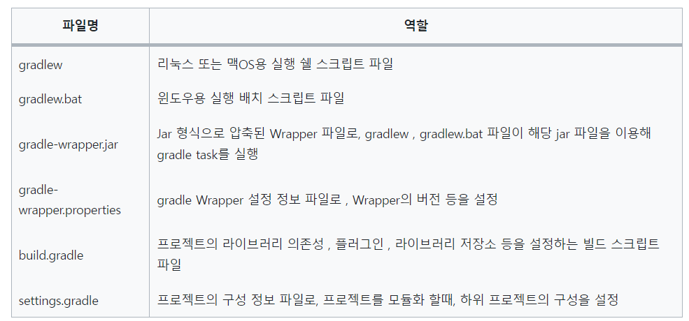
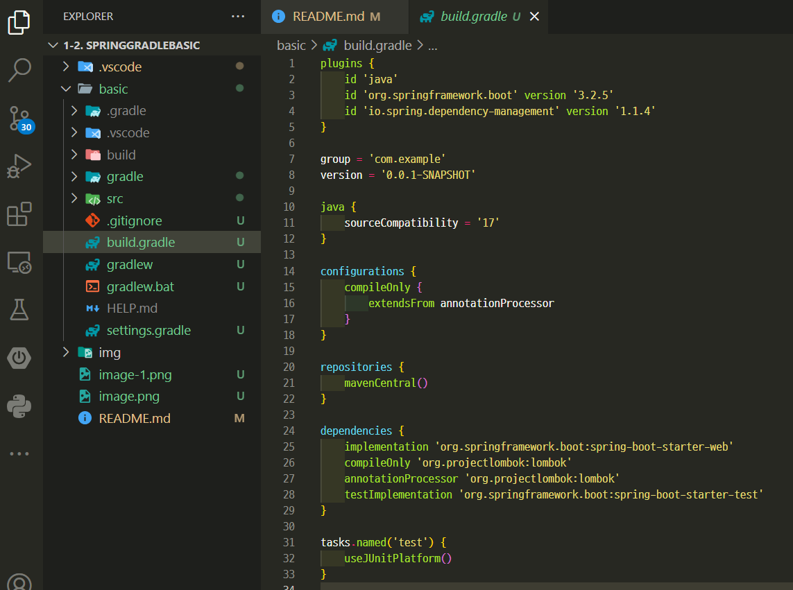
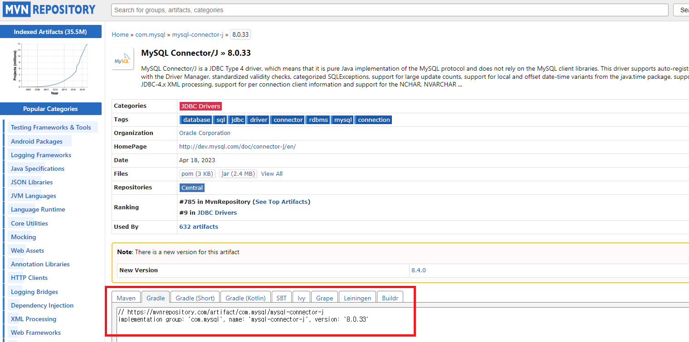
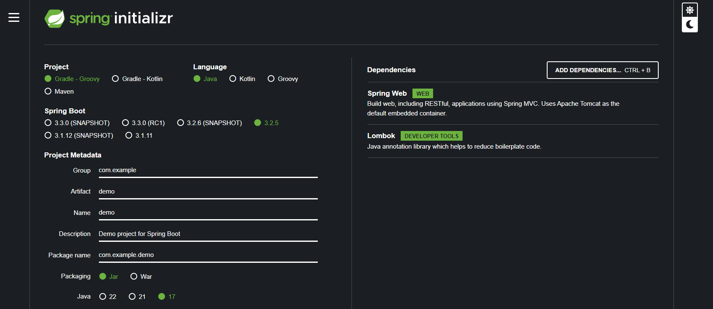

# [Gradle](https://velog.io/@tjseocld/Gradle-%EC%9D%B4%EB%9E%80)
- gradle은 오픈소스 빌드 자동화 툴로, 거의 모든 타입의 소프트웨어를 빌드할 수 있는 유연함을 가집니다.

---
## Gradle 특징 
- High Performance
  - Gradle은 실행시켜야 하는 task만 실행시키고 다른 불필요한 동작은 하지 않으며, build cache를 사용함으로써 이전 실행의 task output을 재사용합니다. 
- JVM foundation
  - Gradle은 JVM 에서 실행되기 때문에 JDK를 설치해야 합니다. 
- Convetions
  - Gradle은 Maven으로부터 의존 라이브러리 관리 기능을 차용했습니다. 
- Extensibility
  - Gradle을 확장하면 고유의 task 타입을 제공하거나 모델을 빌드할 수 있습니다.

---
## Gradle 파일 구성 
- Spring을 Gradle 프로젝트로 생성하면 다음과 같은 구조를 갖게됩니다.
```shell
├─ gradle
│ └─ wrapper
│ ├─ gradle-wrapper.jar
│ └─ gradle-wrapper.properties
├─ gradlew
├─ gradlew.bat
├─ build.gradle
└─ settings.gradle
```

---


---
## Gradle 라이브러리 의존성 관리


---
### build.gradle
- 라이브러리 의존성 설정은 build.gradle 스크립트 파일에 작성할 수 있습니다.
- Dependency Configuration
  - `Implementation` : 구현할 때에만 사용됩니다.
  - `compileOnly` : 컴파일할 때에만 사용하고 런타임에는 사용되지 않습니다.
  - `runtimeOnly` : 런타임 때에만 사용됩니다.
  - `testImplementation` : 테스트할 때에만 사용됩니다.

---


---
### [라이브러리 의존성 주입](https://mvnrepository.com/artifact/com.mysql/mysql-connector-j/8.0.33) 


---
# [basic 프로젝트](https://start.spring.io/)


---
# 참고문서
- [ToDo App 만들기](https://www.youtube.com/watch?v=A_foK6PnsPs)
