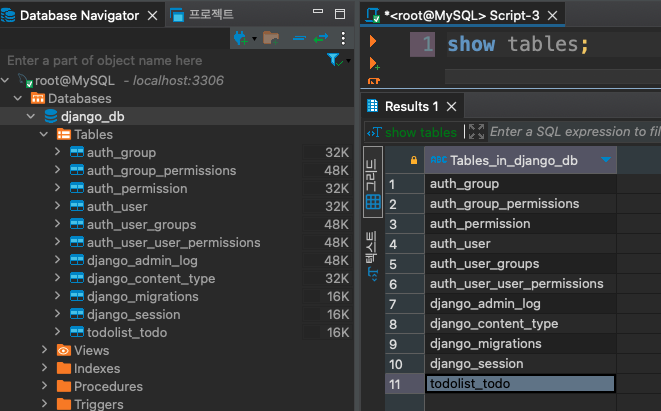

# MySQL 적용
- create_db_user_of_mysql.sql 참고 

---
### 단계1: 데이터베이스 생성
```sql
create database django_db;
show databases;
```


---
### 단계2: 사용자 계정 생성
```sql
use mysql;

create user 'django_root'@'%' identified by 'django_root1!';
select * from user;
```


---
### 단계3: 사용자 권한 부여
```sql
grant all privileges on django_db.* to 'django_root'@'%';
flush privileges; -- 새로운(수정된) 권한 적용 
```


---
### 단계4: mysql 드라이버 설치
```shell
$ (.venv) pip install pymysql
```


---
### 단계5: django with mysql
- config/settings.py에 mysql 설정 추가 
```python
import pymysql 
pymysql.install_as_MySQLdb()

DATABASES = {
    "default": {
        "ENGINE": "django.db.backends.mysql",
        "NAME": "django_db", # 데이터베이스 이름 
        "USER": "django_root", # 유저 아이디
        "PASSWORD": "django_root1!", # 유저 비번
        "HOST": "localhost", # host 주소
        "PORT": "3306" # port 번호 
    }
}
```

---
# [Models](https://docs.djangoproject.com/ko/5.0/topics/db/models/) 
- 모델은 데이터에 대한 단 하나의 정보의 소스입니다. 
- 모델은 저장하고 있는 데이터의 필수적인 필드와 동작을 포함하고 있습니다. 
- 일반적으로, 각각의 모델은 하나의 데이터베이스 테이블에 매핑됩니다.

---
### 단계1: todo 생성 
- todoList.models.py
```python
from django.db import models

# Create your models here.
class todo(models.Model):
    todo_name = models.CharField(max_length=1000)
    status = models.BooleanField(default=False)

    def __str__(self):
        return self.todo_name
```
---
### 단계2: 마이그레이션(migration)
- 테이블 및 필드의 생성, 삭제, 변경 등과 같은 스키마 정보에 대한 변경사항을 저장(기억)
- app 폴더 아래에 migrations 폴더에 마이그레이션 정보 저장 
```shell
$ (.venv) python manage.py makemigrations 
```


---
### 단계3: Database에 마이그레이션 정보 반영 
- 마이크레이션에 저장된 스키마 정보를 이용하여 Database의 테이블 생성/삭제/변경 진행 
```shell
$ (.venv) python manage.py migrate
```
- mysql 테이블 조회 
```sql
show tables;
```


---
# Django 관리자 

---
### 단계1: Admin 계정 
- admin 생성 
```shell
python manage.py createsuperuser 
```


---
### 단계2: Model 등록 
- todolist.admin.py
```python
from django.contrib import admin
from .models import todo

# Register your models here.
admin.site.register(todo)
```
---
# [view](https://docs.djangoproject.com/ko/5.0/intro/tutorial03/)

---
### 단계1: views 정의 
- todolist.views.py


---
### 단계2: 앱 urls에 추가 
- 파일 생성: todolist.urls.py
```python
from django.urls import path
from .views import todo_list, delete_task, update_task

urlpatterns = [
    path("", todo_list, name="todo-list"),
    path("delete-task/<str:task>", delete_task, name="delete-task"),
    path("update-task/<str:task>", update_task, name="update-task"),
]

```

---
### 단계3: config(프로젝트) urls에 추가 
- config.urls.py
```python
from django.contrib import admin
from django.urls import path, include

urlpatterns = [
    path("admin/", admin.site.urls),
    path("", include("todolist.urls")), 
]
```

---
# [templates](https://docs.djangoproject.com/en/4.2/topics/templates/#syntax)
- templates/todolist/todo.html


---
# 서비 실행 
- 마이그레이션(migration)
```shell
$ (.venv) python manage.py makemigrations 
```
- Database에 마이그레이션 정보 반영 
```shell
$ (.venv) python manage.py migrate
```
- server 실행 및 관리자 페이지 접속 
```shell
$ (.venv) python manage.py runserver
``` 
---
# 테스트 결과 


