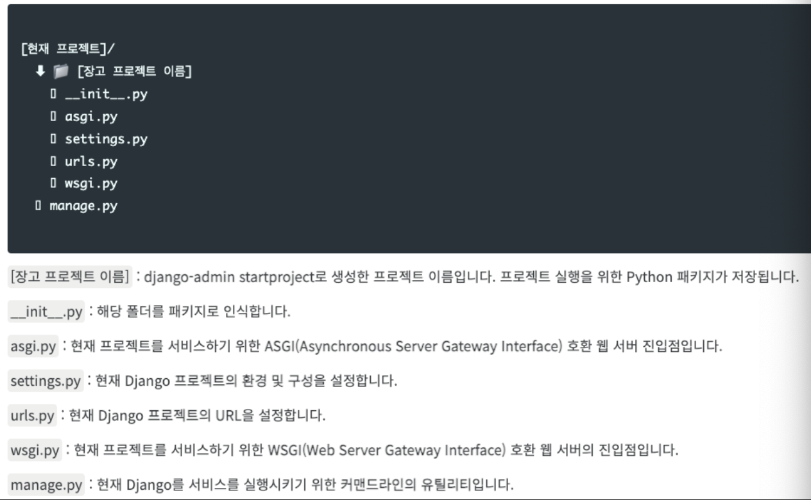
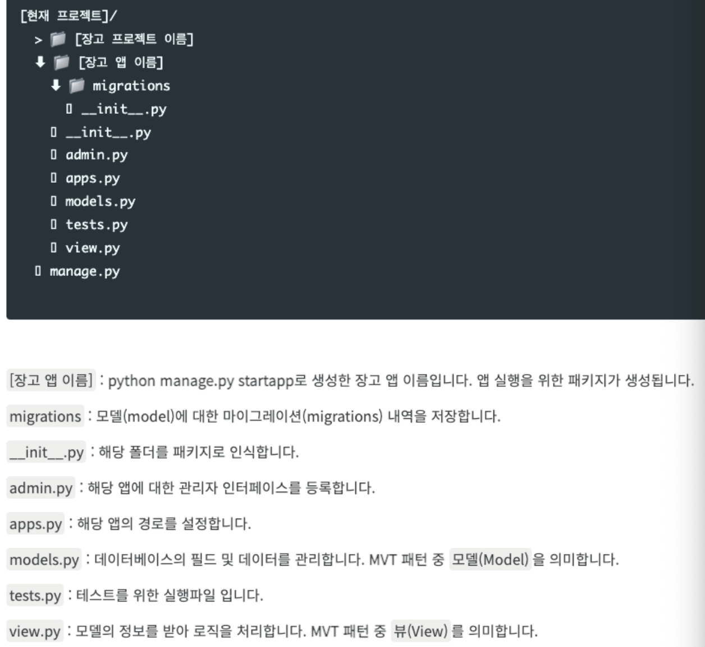

# [Django란?](https://www.djangoproject.com/start/)
- 장고(Django)는 Python 기반의 오픈 소스 웹 애플리케이션 프레임워크(Web Application Framework)입니다.
- 장고를 확용해 UI, UX와 프론트엔드(Front-end) 개발과 Server, DB 등과 관련된 백엔드(Back-end) 개발을 진행할 수 있습니다.

---
# [MTV 패턴](https://velog.io/@hidaehyunlee/Django-MTV-%ED%8C%A8%ED%84%B4)
- 장고는 MVC(Model-View-Controller)를 기반으로 한 프레임워크다. 하지만 장고에서는 같은 개념을 MTV(Model - Template - View)라고 부른다.
- 장고의 기본 구성은 `Model, Template, View`인 MTV 패턴을 따릅니다.
  - `Model`은 데이터에 관한 정보(저장, 접근, 검증, 작동 등)를 처리하고 논리 및 규칙을 직접 관리합니다.
  - `Template`은 데이터가 어떻게 표시되는 지를 정의합니다. 템플릿은 사용자에게 실제로 보여지는 웹 페이지나 문서를 작성합니다.
  - `View`는 어떤 데이터를 표시할지 정의하며, HTTP 응답 상태 코드를 반환합니다.

즉, 데이터베이스에서 관리할 데이터를 정의(Model)하며, 사용자가 보는 화면(Template)과 애플리케이션의 처리 논리(View)를 정의합니다.
장고는 Instagram, Disqus, Mozilla, Pinterest, Bitbucket 등에서도 사용하고 있습니다.

---


---
## [Model tutorial](./Model.md)
## [View tutorial](./View.md)
## [Template tutorial](./Template.md)

---
# [Django 작동원리](https://www.youtube.com/watch?v=LYmZB5IIwAI)


---
# [Django 설치](https://docs.djangoproject.com/en/4.2/intro/install/)

```shell
> python -m pip install --upgrade pip
> pip install django
> python -m django --version
```
# [프로젝트 생성](https://076923.github.io/posts/Python-Django-2/)
`django-admin startproject [프로젝트 이름]`을 통해 장고 기본 프로젝트 생성이 가능합니다.

```shell
(.venv) $ django-admin startproject todolist
```
---


---
## Django Test RunServer
> 테스트 프로젝트는 `http://127.0.0.1:8000/` 에서 확인할 수 있습니다.

```shell
(.venv) $ python manage.py runserver
```
## [프로젝트 설정](https://076923.github.io/posts/Python-Django-3/)
- 장고(Django)의 환경 설정은 setting.py 파일에서 관리할 수 있습니다.
- 환경 설정에서 데이터베이스, 디버그 모드, 허용 가능한 호스트, 애플리케이션 다국어 및 지역 시간 등을 설정할 수 있습니다.
- settings.py 파일의 설정이 올바르지 않거나, 필요한 구성이 누락되었다면 정상적으로 실행되지 않습니다.

---
# [애플리케이션 생성](https://076923.github.io/posts/Python-Django-4/)
- 장고에서 앱(App)은 시스템 및 데이터베이스 등을 통해 서비스를 제공하는 웹 애플리케이션(Web Application)입니다.
- 앱에는 모델(model), 템플릿(template), 뷰(view)를 포함하고 있으며, 여러 앱이 프로젝트를 구성하게 됩니다.
- 프로젝트를 Python의 클래스(class)로 생각한다면, 앱은 함수(function)로 볼 수 있습니다.
- 앱은 재사용성 유/무로 앱의 개수가 결정되며, 재사용성이 없는 경우 하나의 앱으로 사용합니다.
- 앱은 하나의 서비스이며, 앱의 이름은 프로젝트 구성에서 중복되지 않아야 합니다.

`python manage.py startapp [앱 이름]`을 통해 앱 생성이 가능합니다.
```shell
(.venv) $ python manage.py startapp first_app
```

---


---
## 애플리케이션 등록
`settings.py`로 이동하여 `INSTALLED_APPS`에 생성한 앱 이름 추가


```python
# Application definition

INSTALLED_APPS = [
    'django.contrib.admin',
    'django.contrib.auth',
    'django.contrib.contenttypes',
    'django.contrib.sessions',
    'django.contrib.messages',
    'django.contrib.staticfiles',
    'rest_framework',
    'corsheaders',
    'first_app',
]
```
---
# [Migration](https://076923.github.io/posts/Python-Django-9/)
- 마이그레이션(Migration)이란 데이터베이스의 스키마(Schema)를 관리하기 위한 방법입니다.
- 데이터베이스에서는 스키마를 비롯해 테이블, 필드 등의 변경이 발생했을 때 지정된 데이터베이스에 적용하는 과정을 의미합니다.
- 마이그레이션을 통해 데이터베이스를 생성하고 모델의 생성, 변경, 삭제 등에 따라 작업 내역을 관리하고 데이터베이스를 최신화할 수 있습니다.

```shell
(.venv) $ python manage.py makemigrations
```
```shell
(.venv) $ python manage.py migrate
```
---
# Mysql DB 연결
- mysqlclient 설치
```shell
$ pip install mysqlclient
```
- settings.py 수정
```python
# MySQL: https://velog.io/@devmin/Django-MySQL-Connect
DATABASES = {
    "default": {
        "ENGINE": "django.db.backends.mysql",
        "NAME": "django_db", # 데이터베이스 이름
        "USER": "django_root", # mysql 아이디
        "PASSWORD": "django_root1!", # mysql 비번
        "HOST": "localhost", # host 주소
        "PORT": "3306" # 포트
    }
}
```

---
## Django Tutorials
- https://docs.djangoproject.com/en/4.2/intro/
- https://developer.mozilla.org/ko/docs/Learn/Server-side/Django/Tutorial_local_library_website
- https://076923.github.io/posts/Python-Django-2/
- https://www.youtube.com/watch?v=M8UPyeF5DfM&t=2718s

---
# Django CORS 설치

```shell
> python -m pip install --upgrade pip
> pip install django-cors-headers
```
---
# [Django Rest Framework](https://www.django-rest-framework.org/)
Django에서는 REST API를 위한 프레임워크가 존재합니다. 이를 DRF(Django REST Framework)라고 합니다.

### Django Rest Framework 설치
```shell
> python -m pip install --upgrade pip
> pip install djangorestframework
```

### Rest Framework Tutorials
- https://jamanbbo.tistory.com/43
- https://blog.nerdfactory.ai/2021/02/24/creating-an-api-&-collecting-html-elements-with-django-rest-framework.html


