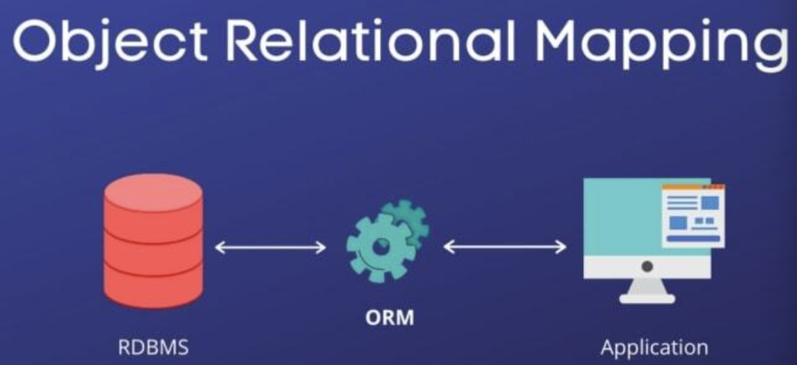

# [Web Overview](./Web%20Overview.md)
- 웹표준(Web Standards)
- 크로스 브라우징(Cross-Browsing)
- 웹접근성(Web Accessibility)
- 검색 엔진 최적화(Search Engine Optimize)
- HTTP / HTTPS 프로토콜

---
# [Web Security](./Web%20Security.md)
- CORS(Cross-Origin Resource Sharing)
- CSRF(Cross-Site Request Forgery)

---
# [로그인](./login.md)
- Authentication(인증)
  - Session/Cookie
  - JWT(Json Web Token)
- Authorization(인가)

---
# [Rest API란?](https://meetup.nhncloud.com/posts/92)
`REST`란 자원(Resource)을 정의하고 자원에 대한 주소(URL)를 지정하는 방법을 의미합니다.
- 자원(Resource): URI
- 행위(Verb): HTTP Method(POST, GET, PUT, DELETE)
- 표현(Representations): JSON, XML, TEXT 등 여러 행태로 응답
- 서버(Server): 자원을 가지고 있는 쪽
- 클라이언트(Client): 자원을 요청하는 쪽

---

---
# [SSR vs CSR](./SSR%20vs%20CSR.md)
- SSR(Server Side Rendering)은 전통적인 웹 어플리케이션 렌더링 방식으로 사용자가 웹 페이지에 접근할 때, 서버에 페이지에 대한 요청을 한다. 
- CSR(Client Side Rendering)은 클라이언트 측에서 최초에 1번 서버에서 전체 페이지를 로딩하여 보여준다. 
  - SPA(Single Page Application)는 최초 한 번 페이지 전체를 로딩한 이후부터는 데이터만 변경하여 사용하는 단일 페이지로 구성된 웹 애플리케이션이다. 
  - SPA frameworks: [React](https://react.dev/), [Vue.js](https://vuejs.org/), [Angular](https://angular.io/)

---
# [codepen](https://codepen.io/seulbinim/pen/rRjBpp/)
- CodePen은 웹 개발자들이 웹 개발 프로젝트를 만들고 공유할 수 있는 온라인 개발 환경입니다. 
- 여기에는 HTML, CSS 및 JavaScript를 작성하고 실행할 수 있는 에디터와 함께, 다른 개발자들과 소스 코드를 공유할 수 있는 기능이 포함되어 있습니다.

---
# Basic
### [html lecture](./1.%20html/README.md)
### [css lecture](./2.%20css/README.md)
### [javascript lecture](3.%20javascript/README.md)

---
# BackEnd

---
## [MVC 패턴](https://www.essenceandartifact.com/2012/12/the-essence-of-mvc.html)
- 옛날 애플리케이션 개발은 다양한 코드 및 기능들이 한 곳에서 만들어졌습니다.
> 즉, 디자인, 프론트엔드, 백엔드 등
- 요즘 애플리케이션 개발은 MVC 패턴을 적용한 모델, 뷰, 컨트롤러 이 3가지 주체로 개발을 진행합니다.
> 유지보수성, 확장성, 유연성 등이 증가하고 중복 코딩이라는 문제점 또한 사라졌습니다.

아래 이미지는 MVC 디자인 패턴이 만들어진 과정이다.
- Model: 안전하게 데이터를 저장
- View: 데이터를 적절하게 유저에게 보여줌
- Controller: 사용자의 입력과 이벤트에 반응하여 Model과 View를 업데이트

---

---
### MVC Roles and Relationships Diagram
1. 사용자가 웹사이트에 접속합니다. (Uses)
2. Controller는 사용자가 요청한 웹사이트를 서비스 하기 위해서 모델을 호출합니다. (Manipulates)
3. Model은 데이터베이스나 파일과 같은 데이터 소스를 제어한 후에 그 결과를 리턴합니다.
4. Controller는 Model이 리턴한 결과를 View에 반영합니다. (Updates)
5. 데이터가 반영된 View는 사용자에게 보여집니다. (Sees)

---

---
## [ORM](https://geonlee.tistory.com/207)
- ORM은 Object Relational Mapping 즉, 객체-관계 매핑의 줄임말이다.
- ORM은 서로 다른 관계형 데이터베이스 관리 시스템(RDBMSs)에서 필드를 스스로 매핑해 간단하게 데이터베이스를 구성할 수 있습니다.

즉, 복잡한 SQL문을 사용하지 않으며, 재사용 및 유지보수의 편리성이 증가합니다.

---

---
### Python
- [Django](./4.%20backend/Django/README.md)
- [FastAPI](./4.%20backend/FastAPI/README.md)
### Java
- [JSP](./4.%20backend/JSP/README.md)
- [Spring Boot](./4.%20backend/SpringBoot/README.md)

---
# FrontEnd
- [React](./5.%20frontend/React/README.md)
- [Vue.js](./5.%20frontend/Vue.js/README.md)

